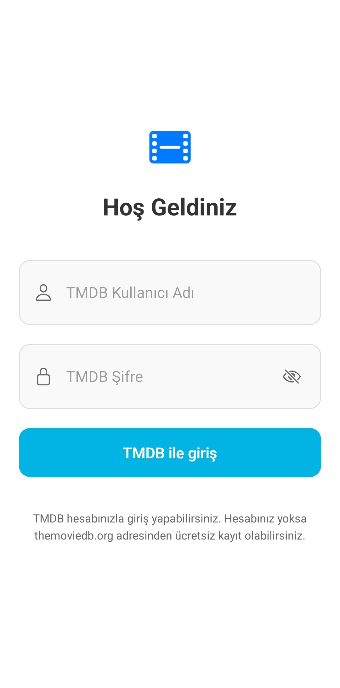
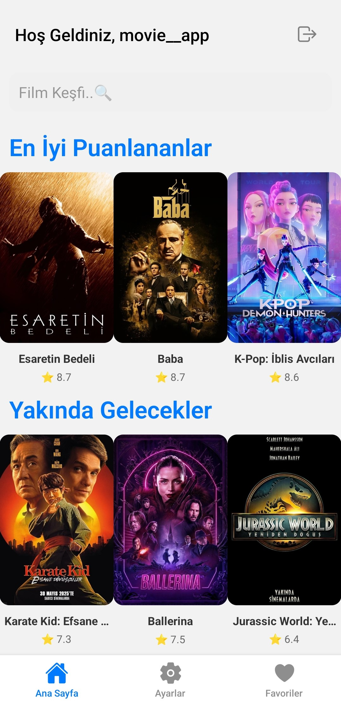
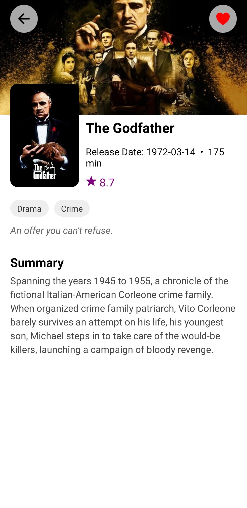
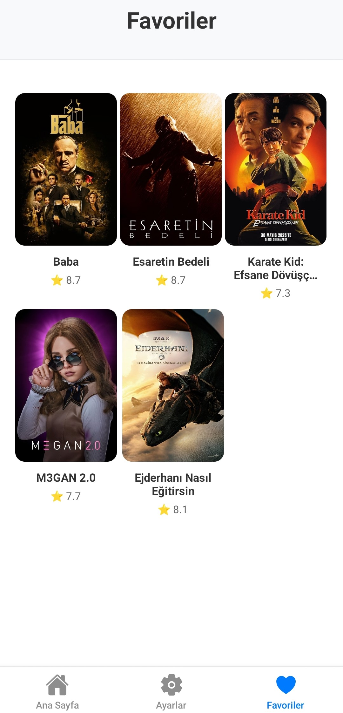

# 🎬 Movie__APP

Movie__APP, [TMDB API](https://www.themoviedb.org/documentation/api) ile entegre çalışan, React Native + Expo kullanılarak geliştirilmiş bir mobil film keşif uygulamasıdır. Kullanıcılar TMDB hesaplarıyla giriş yapabilir, farklı film kategorilerini inceleyebilir, detay sayfalarını görüntüleyebilir ve favori listelerini oluşturabilir. Uygulama İngilizce ve Türkçe dillerinde çalışmaktadır.

##  Özellikler

-  **TMDB Giriş Sistemi**  
  Kullanıcılar TMDB kullanıcı adı ve şifresiyle uygulamaya giriş yapar.

-  **Film Kategorileri**  
    Popüler  
    En İyi Puanlanan  
    Yakında Gelecek  
    Şu Anda Vizyonda  
  Kategoriler TMDB'den canlı veriler çekilir.

-  **Detay Sayfası**  
  Her filmin detay bilgileri, posteri, açıklaması ve puanı yer alır.

- **Favori Listesi**  
  Kullanıcılar istedikleri filmleri favorilerine ekleyebilir ve listelerini görebilir.

-  **İki Dilli Kullanım**  
  Uygulama İngilizce ve Türkçe dillerinde çalışır.

##  Kullanılan Teknolojiler

- [React Native](https://reactnative.dev/)
- [Expo](https://expo.dev/)
- [TMDB API](https://developer.themoviedb.org/docs)
- Context API (Global State Yönetimi)
- React Navigation
- i18n-js (Çoklu Dil Desteği)
  
## Uygulama Görselleri

| Giriş Ekranı | Ana Sayfa | Film Detay | Favoriler |
|-------------|-----------|------------|-----------|
|  |  |  |  |

##  Kurulum

```bash
# 1. Depoyu klonla
git clone https://github.com/Ebrar-ORHANN/movie__app.git

# 2. Proje dizinine gir
cd movie__app

# 3. Bağımlılıkları yükle
npm install

# 4. Projeyi başlat
npx expo start


